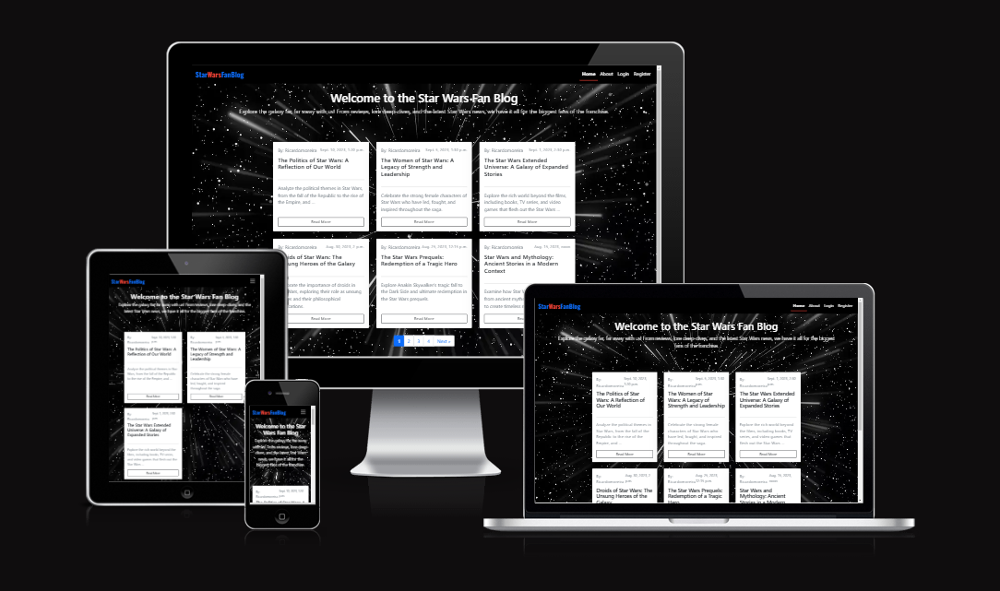
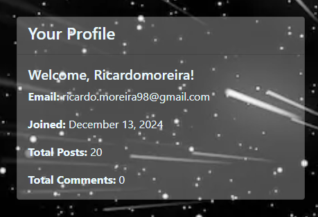
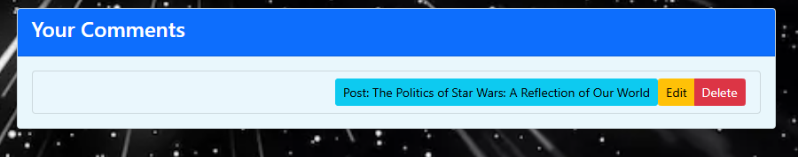
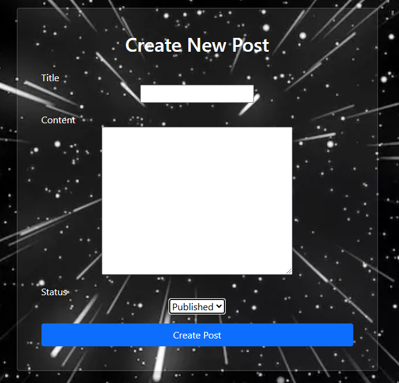
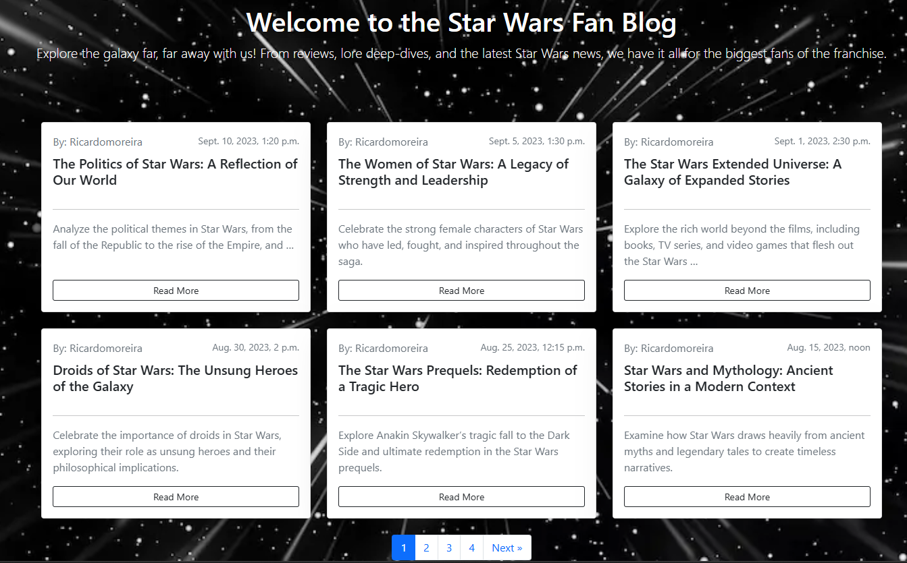
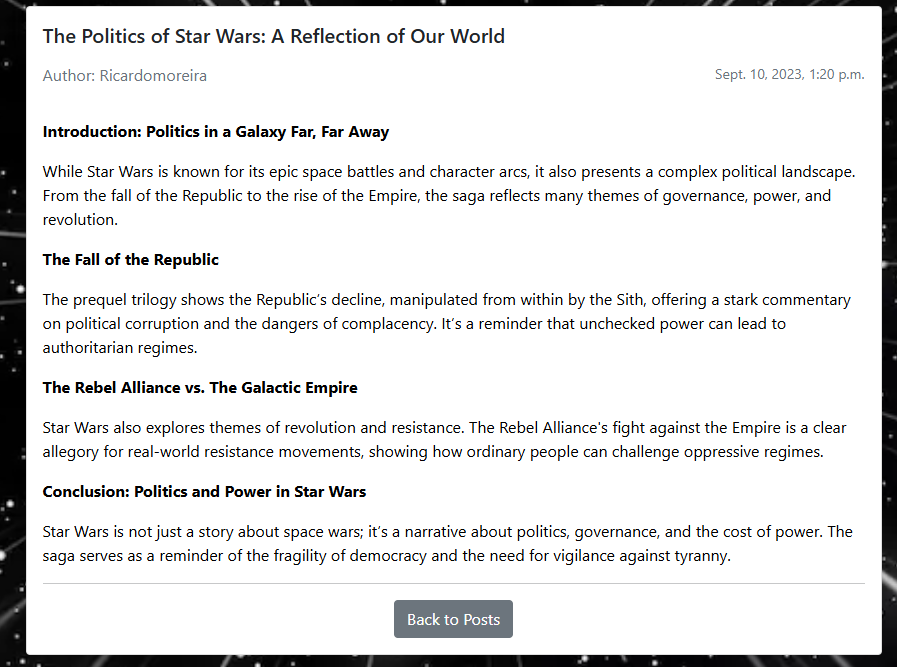

# Star Wars Fan Blog

Welcome to **Star Wars FanBlog**, a fan-driven blog created for enthusiasts to celebrate and explore the galaxy far, far away. Whether you’re passionate about analyzing the lore of the Star Wars universe, reviewing the latest shows, movies, and books, or reminiscing about your favorite moments from the saga, this platform is the perfect destination for every Star Wars fan.

With **Star Wars FanBlog**, you can easily craft and share blog posts, offering your unique insights on everything from character arcs and epic battles to the rich storytelling and cinematic brilliance of the franchise. Our intuitive interface allows you to discover new content, engage in spirited discussions, and connect with a vibrant community that shares your love for all things Star Wars.

Join us in creating a hub where every fan’s voice can shine, and where diverse perspectives and thoughtful conversations about the Star Wars galaxy come together. Step into **Star Wars FanBlog** and start sharing your Star Wars journey today!


  <center>

   

  </center>


Developer: [Ricardo Moreira](https://github.com/RicardoMor98) <br>
[Live webpage](https://starwarsfanblog-cf58dc405513.herokuapp.com/)<br>
[Project Repository](https://github.com/RicardoMor98/Starwars_FanBlog)<br>


# Project Goals 

Star Wars FanBlog is a web application built with Django, designed to offer a vibrant platform for Star Wars fans to connect and share their passion, insights, theories, and personal experiences related to the Star Wars universe. This project focuses on the following key goals:

- **Celebrating Star Wars Fandom** Creating a dedicated space for fans to contribute blog posts, reviews, and discussions about movies, shows, books, comics, games, and more.
- **Seamless User Experience:** Delivering an intuitive and visually engaging interface that encourages exploration and active participation within the Star Wars community.
- **Content Organization:**  Allowing users to organize and manage their posts, reviews, and discussions effectively, categorized by themes such as characters, lore, timelines, or media types.

- **Personalized Profiles:** Enabling users to showcase their favorite Star Wars media, track contributions, and customize their profiles to reflect their unique Star Wars identity.
- **Community Engagement:** Fostering meaningful connections through comments, discussions, and collaborative reviews to strengthen the shared love of Star Wars.
- **Administrative Oversight:**  Equipping administrators with tools to manage user accounts, moderate content, and maintain a safe and inclusive space for fans of all ages and perspectives.


### User Goals
- Exploring and sharing detailed game reviews and posts.
- Personalizing their profiles to showcase their gaming interests.
- Engaging in discussions and leaving comments to contribute to the gaming community.
- Submitting their own game reviews, posts, and perspectives.


### Site Owner Goals

  For Star Wars FanBlog, users will be able to:

- Explore and Share Content: Dive into and contribute detailed posts and reviews about Star Wars movies, shows, books, games, and lore.
- Personalize Profiles: Customize their profiles to showcase favorite Star Wars characters, media, timelines, or factions, creating a personal connection to the community.
- Engage in Discussions: Participate in thoughtful discussions and leave comments to connect with other fans and contribute to the vibrant Star Wars community.
- Submit Their Own Content: Share unique perspectives, theories, and reviews to celebrate their love for Star Wars and enrich the platform’s content.

 Project **Star Wars FanBlog** is dedicated to developing a vibrant community where Star Wars fans can connect, share, and explore the Star Wars universe through insightful posts, engaging discussions, and in-depth reviews.


# User Experience

### Target Audience

Star Wars FanBlog caters to:

- Passionate Star Wars Fans: Enthusiasts who are deeply invested in the Star Wars universe and are looking for detailed insights, theories, and reviews on movies, shows, books, and games.
- Those Exploring the Star Wars Saga: Fans who wish to explore different aspects of Star Wars, from its lore and characters to its expanded universe across multiple media.
- Contributors of Content: Users eager to share their own reviews, theories, fan fiction, and personal experiences, offering their unique perspectives on Star Wars.
- Engaged Community Members: Fans interested in discussing their favorite moments, characters, and Star Wars-related topics with like-minded individuals.
- Those Keeping Up with Star Wars Trends: Users who want to stay up-to-date with the latest Star Wars releases, news, and fan conversations within the community.


### User Requirements and Expectations

Users of **Star Wars FanBlog** can anticipate the following features and attributes to meet their needs:

- An intuitive and user-friendly interface that facilitates easy navigation and access to Star Wars content.
- In-depth reviews, posts, and analyses that provide thorough insights into the Star Wars universe, including movies, shows, books, games, and lore.
- A responsive design that ensures an attractive and functional experience across various devices, from desktops to mobile.
- Personalized elements, such as user profiles, that highlight Star Wars preferences, showcase favorite characters or media, and track individual contributions.
- Opportunities for interactive participation through comments, discussions, and fan theories to build a strong and engaging community.


**Star Wars FanBlog** is dedicated to offering an engaging and immersive platform for users to explore, share, and discuss their passion for Star Wars.

# User Stories

### Agile Planning and Development

<br>

At Star Wars FanBlog, our planning and development process is guided by Agile methodologies and principles. While we don't adhere strictly to traditional Agile frameworks like scheduled sprints or scrums, we emphasize flexibility, continuous improvement, and the ability to adapt quickly to changing needs. Instead of focusing on sprints, we prioritize developing epics that align with the core functionalities of the platform, addressing User Stories based on their priority and impact on the user experience.

Our overarching strategy divides the project into three key phases: planning, development (which includes unit and functional testing), and continuous deployment. Documentation is created, reviewed, and updated throughout the entire process, ensuring clear communication and transparency.

Our approach is streamlined: we begin by developing essential features and core functionalities, then progressively tackle more complex aspects and enhancements. We actively engage with user feedback to identify areas for improvement, ensuring the platform evolves in line with the needs and expectations of the Star Wars fan community. This iterative process allows us to deliver a highly responsive and user-centered experience.

We used a project [User stories board](https://github.com/users/RicardoMor98/projects/4) to track progress.

<br>

### Blog Application Database Schema

#### UserProfile Table
- Extends the User model to store additional user-specific information.
- Fields: one-to-one relationship with the User model, username, bio email, date of registration, total of posts, total of comments.

 

#### User Posts Dashboard
- Represents user Posts. ( Django built In )
- Fields: user can have visible his posts, view them, edi, delete.

 

#### User Comments Dashboard
- Represents comments created by user.
- Fields: user can see the posts he commented, can edit, delete them.


#### Comment Table

- Represents comments on blog posts.
- Fields: users can add comments to start a dialogue about the post.



<br>
This database schema defines the structure and relationships for a blog application, including users, posts, comments, user profiles.

  

# Design
In the world of **Star Wars FanBlog**, the design philosophy revolves around creating a modern and immersive user interface that brings the Star Wars universe to life. Drawing inspiration from the iconic aesthetics of Star Wars, the goal is to offer a visually engaging experience that resonates with fans. The primary objective is to ensure effortless navigation, discovery, and interaction with a rich array of Star Wars-related content, from movie reviews and character analyses to fan theories and news updates. The design aims to captivate users with thematic visuals and smooth functionality, making it easy for fans to explore and contribute to the community.


### Fonts

**Star Wars FanBlog** utilizes the default fonts provided by Bootstrap 5, ensuring a clean and polished look that enhances both the visual appeal and user experience of the site. This choice allows for a seamless and consistent design without the need for additional font customization, while still maintaining the site's immersive atmosphere and ensuring readability across all devices.

### Structure

The website is designed with a user-friendly structure to ensure smooth navigation and easy access to content. Here's a summary of the site layout:

#### Before Logging In:

- **Landing Page:** The landing page introduces visitors to **Star Wars FanBlog**, showcasing the platform and highlighting the exciting Star Wars content and features available.<br>
- **About Us:**  The About Us page offers insight into **Star Wars FanBlog**, including our mission, values, and the benefits of being part of our passionate Star Wars fan community<br>
- **Sign Up:** New users can quickly create an account on the Join Us page by providing the necessary information to join **Star Wars FanBlog** and become part of the community.<br>
- **Log In:** Existing users can access their accounts and explore the full range of Star Wars-related content and discussions by logging in through the Log In page.<br>


#### After Logging In:

Once you're logged into **Star Wars FanBlog**, you'll be immersed in our vibrant Star Wars community with access to the following pages:

- **Home Page:** The homepage serves as your gateway to the latest Star Wars posts, reviews, discussions, and news, keeping you updated with the most recent fan content.<br>
- **Profile Page:** Your personalized profile where you can showcase your favorite Star Wars media, track your contributions, and manage your account settings.<br>

We’ve designed this space to be your premier Star Wars hub, where you can engage, explore, and exchange thoughts with other passionate Star Wars fans. Whether you’re diving deep into the lore, discussing your favorite characters, or reviewing the latest Star Wars releases, **Star Wars FanBlog** offers a vibrant platform for every fan to connect and share their love for the galaxy far, far away.

### Wireframes

<details><summary>Create Post View</summary>

</details>


# Technologies Used

### Languages
- HTML
- CSS
- JavaScript
- Python

### Frameworks
- Django: A high-level Python web framework used for building the Star Wars FanBlog web application.
- Crispy Forms: A Django package used for rendering forms in a more efficient and customizable way.
- Bootstrap v5.3: A popular CSS framework used for creating responsive and visually appealing user interfaces.
- Cloudinary: A cloud-based media management platform used for storing and serving images in the Blog Collective project.(In process to include on the blog)

### Database
- PostgreSQL database as a service. It is used as the database for the Blog Collective project, providing a reliable and scalable storage solution for the application's data.

### Tools
- **Git**: A distributed version control system used for tracking changes in the project's source code.
- **GitHub**: A web-based hosting service for version control repositories, used for storing and managing the project's source code.
- **Gitpod**: An online integrated development environment (IDE) used for developing and testing the Gamers United project.
- **Heroku**: A cloud platform that enables deployment and hosting of web applications. Heroku was used for deploying the Gamers United project to a live server.
- **Google Fonts**: A collection of free and open-source fonts used for typography on Gamers United website.


### Supporting Libraries and Packages
- asgiref==3.8.1
- cloudinary==1.41.0
- crispy-bootstrap5==0.7
- dj-database-url==0.5.0
- Django==4.2.17
- django-cloudinary-storage==0.3.0
- django-crispy-forms==2.3
- django-summernote==0.8.20.0
- gunicorn==20.1.0
- pillow==11.0.0
- psycopg2==2.9.10
- sqlparse==0.5.3
- whitenoise==5.3.0


# Methodology

**The Star Wars FanBlog** project follows a methodology inspired by agile principles, fostering collaboration, flexibility, and gradual development. The outlined approach has guided the project's evolution:


### Agile Project Management with GitHub Projects
To streamline project management, GitHub Projects is employed as a central hub. User stories and tasks are structured as GitHub issues, creating an organized workflow. The GitHub project board serves as a visual representation, tracking progress effectively.

### User Stories as GitHub Issues
Transforming user stories into GitHub issues captures user-centric functionalities. These issues interlink with respective user stories, simplifying access to criteria, tasks, and discussions.

### Bug Tracking for Seamless Development
Bugs uncovered during development are documented as GitHub issues, offering insights into each bug's characteristics, impact, and reproduction steps. By hyperlinking these issues in README.md, users can stay updated on bug resolutions and contribute insights.

### Iterative Development Approach
--

### Future Backlog and Progress
---

**Labels and User Story Distribution (MoSCoW):**

- **Must-Have:** -
- **Should-Have:** -
- **Could-Have:** -
- **Wont-Have:** -
- **Task:** -


# Features

### Landing Page/Home Page:
- The landing page features an iconic Star Wars slogan, such as "Welcome to the **Star Wars Fan Blog**
Explore the galaxy far, far away with us! From reviews, lore deep-dives, and the latest Star Wars news, we have it all for the biggest fans of the franchise." This immediately sets the tone and immerses visitors into the Star Wars universe.<details><summary>See Screenshot **Landingpage**</summary></details>


### Post Detail Page:
- The post details page displays comprehensive information about each post, including details about the writer and the post's creation date as well with the comments to the post.<details><summary>See Screenshot **Post detail**</summary></details>


### User Account Management:
- The account sign-up form allows new users to create an account and join the Star Wars FanBlog. The form has validation to make sure that the user enters the correct information needed. This is a Django built-in validation system. Such validation is:

    - **Username**: Required and has a maximum of 150 characters or fewer. Only letters, digits, and @/./+/-/_ are allowed.
    - **Email**: Required and must be in a valid email format.
    - **Password**: Subject to the following constraints:
        - Must contain at least 8 characters.
        - Cannot be a commonly used password.
        - Cannot be entirely numeric.


- When an account is successfully created, the user will receive a confirmation message and gain access to the profile menu.

- Users can access their profile page, where they can edit, delete, their posts and comments.

- Users can also use the "Logout" option to sign out of their accounts. Upon doing so, they will be directed to the Home Page.


### Navigation:

- Both unauthorized and authorized users have access to the About Us page. 

- On smaller screens, the navigation bar collapses into a burger menu, allowing for a compact and mobile-friendly navigation experience. Users can access the menu by clicking on the burger icon, which reveals the navigation options in a dropdown fashion.


### Future Features

Here are some exciting enhancements we plan to introduce to **Star Wars FanBlog**:

- **Favorites and Save for Later:**  
  Allow users to mark blog articles as favorites or save them for later reading, making it easier to revisit content.

- **Effortless Social Media Sharing:**  
  Enable users to easily share their favorite blog posts across various social media platforms, increasing the reach and visibility of **Star Wars FanBlog**.

- **Multilingual Capabilities:**  
  Add support for multiple languages to make **Star Wars FanBlog** accessible to a global audience and foster a more inclusive experience.

- **Email Verification for Account Creation:**  
  Implement email verification during account setup to improve security and ensure user authenticity.

- **Password Recovery Options:**  
  Introduce a password recovery feature to allow users to securely reset their passwords and regain access to their accounts.

- **Image/Avatar:**
Allow user to add a profile image or avatar with Star Wars characters.


# Testing

---

All testing, including both manual and automated testing, was carried out and documented in [Testing.md](TESTING.md). 


# Bugs


### Fixed bugs

| **Bug** | **Fix** |
| ------- | ------- |
| [-](http) | --- |
| [-](http) | --- |
| [-](http) | --- |
| [-](http) | --- |
| [-](http) | --- |
| [-](http) | --- | -- |


# Deployment

### App Deployment
For deploying Your app, Heroku is used. Follow these steps:

 **Create a New App:**
   - Create a new app on Heroku dashboard.

 **Configure Settings:**
   - Navigate to "Settings" in new app.

 **Config Vars Setup:**
   - In "Config Vars," add `PORT` as the key and `8000` as its value.

 **Add PostgreSQL Database:**
   - Choose PostgreSQL as database.

        Example "ElephantSQL" was used in this project

 **Configure DATABASE_URL:**
   - In "Config Vars," add `DATABASE_URL` and copy the URL from PostgreSQL dashboard.

     Note: If using PostgreSQL provider, you can use the URL provided by PostgreSQL.

 **Environment Variable Setup:**
   - Create a new file in workspace called `env.py`.
   - Import the `os` library and set the environment variable for `DATABASE_URL` to the Heroku address (or ElephantSQL URL)
   - Add a secret key using `os.environ["SECRET_KEY"] = "your secret key here"`.

 **Heroku Config Vars:**
   - Add the secret key to the Heroku app's config vars in the settings.

 **Django Settings:**
   - In `settings.py` of Django app, import `Path` from `pathlib`, `os`, and `dj_database_url`.
   - Add `if os.path.isfile("env.py"): import env` to the file.
   - Replace the SECRET_KEY with `SECRET_KEY = os.environ.get('SECRET_KEY')`.
   - Replace the database section with `DATABASES = {'default': dj_database_url.parse(os.environ.get("DATABASE_URL"))}`.

 **Migrate Models:**
   - In workspace terminal, migrate the models to the new database connection.

### Cloudinary
To integrate Cloudinary into project, follow these steps:

 **Cloudinary Account:**
   - Log in to Cloudinary account or create one.

 **Copy CLOUDINARY_URL:**
   - Copy `CLOUDINARY_URL`.

 **Environment Variable Setup:**
   - In `env.py`, add `os.environ["CLOUDINARY_URL"] = "add cloudinary_url here"`.

 **Heroku Config Vars:**
   - In Heroku settings, add `CLOUDINARY_URL` to config vars.

 **Django Settings:**
   - In `INSTALLED_APPS`, add `cloudinary_storage`, `Django.contrib.staticfiles`, and `cloudinary` in this order.
   - Configure static file settings in `settings.py`: URL, storage path, directory path, root path, media URL, and default file storage.

 **Templates Directory Link:**
   - Link the file to the templates directory in Heroku with `TEMPLATES_DIR = os.path.join(BASE_DIR, 'templates')`.

 **Change Templates Directory:**
   - Change the templates directory to `TEMPLATES_DIR - 'DIRS': [TEMPLATES_DIR]`.

 **Additional Folders:**
   - Create three new folders: `media`, `static`, and `templates`.

 **Procfile Creation:**
   - Create a `Procfile`.
   - Add the following line inside the Procfile: `web: gunicorn project_name_here.wsgi`.

 **Push Changes:**
    - Push all changes to GitHub.

 **Manual Deployment:**
    - In the Heroku deployment tab, deploy to Heroku manually the first time and closely monitor the process.
    - Once successful, set up automatic deployments.

### Version Control
To manage version control and push code to the main repository on GitHub using GitPod, follow these steps:

 **Add Changes:**
   - In the GitPod terminal, use the command `git add .` to stage changes.

 **Commit Changes:**
   - Commit changes with a descriptive comment using the command:
     ```
     git commit -m "Push comment here"
     ```

 **Push to GitHub:**
   - Push the updates to the repository on GitHub with the command:
     ```
     git push
     ```


 **Migrate Models:**
    - In the terminal, migrate the models to the new database connection.

### Forking the Repository:

By forking the GitHub Repository, can create a copy of the original repository without affecting the original. Follow these steps:

 **GitHub Account Setup:**
   - Log into GitHub account or create one if you don't have one.

 **Locate the Repository:**
   - Find the repository at [https://github.com/RicardoMor98/Starwars_FanBlog](https://github.com/RicardoMor98/Starwars_FanBlog).

 **Fork the Repository:**
   - At the top right of the repository page, click "Fork" to create a copy in your own GitHub repository.

### Clone of the Repository:

Creating a clone allows you to have a local copy of the project. Follow these steps:

 **Repository URL:**
   - Navigate to [https://github.com/RicardoMor98/Starwars_FanBlog](https://github.com/RicardoMor98/Starwars_FanBlog).
   - Click the green "Code" button at the top right.

 **Clone the Repository:**
   - Select the "Clone by HTTPS" option and copy the provided URL to the clipboard.

 **Terminal and Git:**
   - Open your code editor or terminal and navigate to the directory where you want to clone the repository.
   - Run `git clone` followed by the copied URL.
   - Press enter, and Git will clone the repository to your local machine.


To fork the repository, follow these steps:

1. Go to the GitHub repository.
2. Click on the Fork button in the upper right-hand corner.
3. Wait for the forking process to complete. Once done, you will have a copy of the repository in your GitHub account.

To clone the repository, follow these steps:

1. Go to the GitHub repository.
2. Locate the Code button above the list of files and click it.
3. Select your preferred method for cloning: HTTPS, SSH, or GitHub CLI, and click the copy button to copy the repository URL to your clipboard.
4. Open Git Bash (or your preferred terminal).
5. Change the current working directory to the location where you want the cloned directory to be created.
6. Type the command `git clone` followed by the URL you copied in step 3. The command should look like this: `git clone https://github.com/YOUR-USERNAME/YOUR-REPOSITORY`.
7. Press Enter to create your local clone.


# Credits
I would like to express my gratitude to the following resources, which have been a huge help to me in the development of the Gamers United - Blog.

### Media
Images are taken from the following page:
- [Galatic Universe](https://depositphotos.com/vectors/star-wars-galaxy.html) **-**


### Django Documentation:
The official Django documentation has been an invaluable resource throughout the project, providing comprehensive guidance on models, forms, templates, and various aspects of Django development.

- [Models](https://docs.djangoproject.com/en/4.2/topics/db/models/)
- [Form Validation](https://docs.djangoproject.com/en/4.1/ref/forms/validation/)
- [Model Field Types](https://docs.djangoproject.com/en/4.2/ref/models/fields/#model-field-types)
- [CSRF Trusted Origins](https://docs.djangoproject.com/en/4.0/ref/settings/#csrf-trusted-origins)
- [Built-in template tags and filters](https://docs.djangoproject.com/en/4.2/ref/templates/builtins/)
- [Creating forms from models](https://docs.djangoproject.com/en/4.2/topics/forms/modelforms/)
- [Model instance reference](https://docs.djangoproject.com/en/4.2/ref/models/instances/)
- [Signals](https://docs.djangoproject.com/en/4.2/topics/signals/)
- [Using mixins with class-based views](https://docs.djangoproject.com/en/4.2/topics/class-based-views/mixins/#detailview-working-with-a-single-django-object)
- [Using widgets in the form](https://docs.djangoproject.com/en/4.2/ref/forms/widgets/)
-

### W3 Schools:
- [-]()

### Bootstrap docs:
- [Increase knowledge of bootstrap framework](https://getbootstrap.com/docs/5.3/getting-started/introduction/)

### Geeksforgeeks: 
- [Using crisp form](https://www.geeksforgeeks.org/styling-django-forms-with-django-crispy-forms/)

### Various tutorials and YouTube channels:
I would like to extend my appreciation to the authors of the tutorials and YouTube channels that have shared their knowledge and expertise in Django development, enabling me to learn and apply best practices in building Gamers United.
- [Python Django Tutorial: Full-Featured Web App Part 1 - Getting Started](https://www.youtube.com/watch?v=UmljXZIypDchttps://www.youtube.com/watch?v=UmljXZIypDc)
- [Python and Django - Django Blog ](https://www.youtube.com/watch?v=B40bteAMM_M&list=PLCC34OHNcOtr025c1kHSPrnP18YPB-NFi)
- [Django Recipe Sharing Tutorial ](https://www.youtube.com/watch?v=sBjbty691eI&list=PLXuTq6OsqZjbCSfiLNb2f1FOs8viArjWy&index=1)

### Content

- Paragraphs/text for the webpage/readme was written together with [ChatGPT](https://chat.openai.com/)


# Acknowledgments
I'd like to give recognition to the individuals who supported me with this project:

* Abhishek, for the support during the project.

* Vernell, for support and guidance.

* Laura, for support and guidance.

* Tutor support [Code Institute:](https://codeinstitute.net/) for the patience  and guide through my mistakes.

[Code Institute Slack Channel:](https://codeinstitute.net/) Where all the amazing people are very supportive and helpful.

I am truly grateful for their contributions, which have greatly enriched my learning and development.