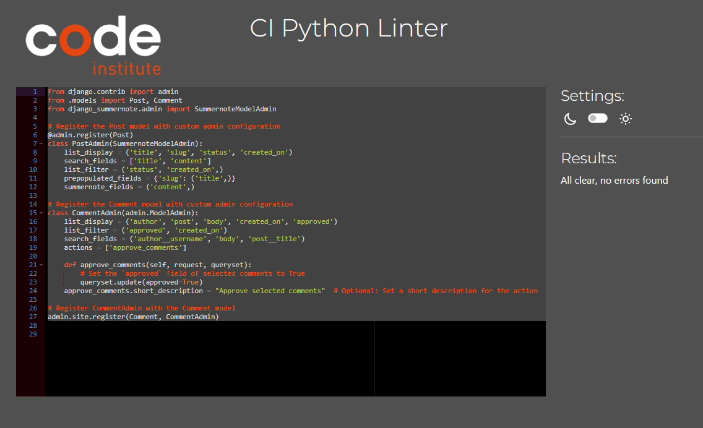

# Star Wars FanBlog Testing

## Table of Contents

1. [Testing User Stories](#testing-user-stories)
    1. [Blog Accessibility](#blog-accessibility)
    2. [Account Management](#account-management)
    3. [Dashboard Management](#dashboard-management)
    4. [Content Management](#content-management)
    5. [Engagement and Information](#engagement-and-information)
2. [Code Validation](#code-validation)
    1. [HTML](#html)
    2. [CSS](#css)
    3. [JavaScript](#javascript)
    4. [Python](#python)
3. [Manual Testing](#manual-testing)
    1. [General](#general)
    2. [Admin Features](#admin-features)
    3. [Account Management](#account-management)
    4. [Pages](#pages)
4. [Device and Browser Testing](#device-and-browser-testing)
    1. [Device Compatibility](#device-compatibility)
    2. [Browser Compatibility](#browser-compatibility)
5. [Bugs](#bugs)
6. [Accessibility](#accessibility)

## Testing User Stories

### Blog Accessibility
As a **guest user**, I can **view blog posts without the need to log in or register** so that **I can freely access content on the site**.
- Blog posts are available without users needing to create an account or log in.
- Previews of each post are available on the home page.
- Navigation on the bottom of the page allows users to browse previews across multiple pages.

As a **guest user**, I can **click on a post preview** so that **I can open the full post and read it in detail**.
- Previews of each post are available on the home page.
- Clicking on a preview opens a full-page view of the post.
- A *Back to Posts* button allows users to return to their previous spot after viewing the full-page post.

As a **registered user**, I can **access exclusive content** so that **I can engage with the community and share information**.
- Only registered and logged-in users can access and update their Dashboard.
- Only registered and logged-in users can create, edit, or delete posts.

**Note**: Due to time constraints, the ability for logged-in users to create and edit comments and / or participate in forum discussions, which was part of this User Story, has not been implemented.

### Account Management

As a **guest user**, I can **create an account** so that **I can have a personalized experience and access member-only features.**.
- Users can create an account using their email address.
- Users are provided with feedback messages for invalid form inputs.
- Users do not receive a confirmation email after successful registration.

As a **registered user**, I can **log in to my account** so that **I can access my Dashboard and other member-only features**.
- Users can log into their accounts using their username and password.
- Users are redirected to the home page after logging in.
- Logged-in users can access more sites and features than guest users, such as their Dashboard and the ability to create, edit, and delete posts.

As a **registered user**, I can **log out of my account** so that **I can ensure my account security and privacy**.
- Users can log out of their accounts.
- Users need to confirm that they want to log out before being logged out.
- Users are redirected to the home page after logging out.

### Dashboard Management

As a **registered user**, I can **delete my blog posts/comments from my Dashboard**, I can **Like/Dislike blog posts** I can **manage my content board**.
- Each blog/comment post preview displays a *Delete* button.
- Each blog post preview displays a *Like/Dislike* button.
- When clicked, the corresponding blog post is removed from the Dashboard.
- A feedback message indicates a post has been deleted successfully.

As a **registered user**, I can **click on a post preview** so that **I can open the full post and read it in detail**.
- Blog posts appear as previews on the Dashboard.
- When clicking on the preview, the user is redirected to the full-page view of the post. 
- A *Back to Posts* button returns users to their Dashboard from the full-page view.

### Content Management

As a **registered user**, I can **create a new blog post** so that **I can share my experiences and tips with the community**.
- A form to create a new blog post is available for logged-in users.
- Users are redirected to the Home page view of their newly created post after successful submission.

As a **registered user**, I can **update my existing blog posts** so that **I can correct or update the content I have shared with the community**.
- Logged-in users see an *Edit* button on posts that they authored.
- A WYSIWYG editor is provided to improve the users' experience.
- After submission, a user feedback message informs users that their post has been updated successfully.

As a **registered user**, I can **delete my blog posts/comments** so that **I can remove content that I no longer want to share with the community**.
- Logged-in users see a *Delete* button on posts that they authored.
- After submission, a user feedback message informs users that their post has been deleted successfully.
- After submission, users are redirected to the home page.

As a **registered user**, I can **access and manage all my authored posts/comments from a central page** so that **I can efficiently maintain and update my content**.
- Users can access a list of all their authored posts from their account drop-down menu. 
- Users can open, update, or delete each post straight from their post list. 
- Users can easily switch between views of their authored and saved posts. 

### Engagement and Information

As a **guest user**, I can **learn about Star Wars FanBlog experiences** so that **I feel connected to the community and inspired to engage with the content**.
- The *About* page is available to view without needing to create an account or log in.

## Code Validation

### HTML

[W3C Markup Validator](https://validator.w3.org/) was used to validate the HTML code of each templated page. HTML validation was performed via source code text input.

| Tested | Result | View Result | Pass |
--- | --- | --- | ---
|Home | No errors or warnings to show. | 

Validation Image

| Pass |
|About | No errors or warnings to show. | 

Validation Image

| Pass |
|Postal View | No errors or warnings to show. | 

Validation Image

| Pass |
|Create Post | No errors or warnings to show. | 

Validation Image

| Pass |
|Edit Post | No errors or warnings to show. | 

Validation Image

| Pass |
|Sign In | No errors or warnings to show. | 

Validation Image

| Pass |
|Sign Up | No errors or warnings to show. | 

Validation Image

| Pass |

**Note**: *Post View* appear some errors.

### CSS

[W3C CSS Validator](https://jigsaw.w3.org/css-validator/) was used to validate the custom CSS code.

| Tested | Result | View Result | Pass/Fail |
--- | --- | --- | ---
|style.css | No Error Found. | 

Validation Image

| Pass |

### JavaScript

[JSHint](https://jshint.com/) was used to validate the custom JavaScript code.

| Tested | Result | View Result | Pass/Fail |
--- | --- | --- | ---
|script.js | No errors | Did not use script.js file except the ones come with summernote

### Python

[PEP8 Online Check](https://pep8ci.herokuapp.com) was used to validate the custom Python code.

| Tested | Result | View Result | Pass/Fail |
--- | --- | --- | ---
|blog/admin.py | All clear, no errors found | 

Validation Image

 | Pass |
|blog/forms.py | All clear, no errors found | 

Validation Image

 | Pass |
|blog/models.py | All clear, no errors found | 

Validation Image

| Pass |
|blog/urls.py | All clear, no errors found | 

Validation Image

| Pass | some errors |
|blog/views.py | All clear, no errors found | 

Validation Image

| Pass | some errors |
|swfb/urls.py | All clear, no errors found | 

Validation Image

| Pass |

## Manual Testing

### General

#### Header

| Element | Expected Outcome | Pass/Fail | Notes |
|---|---|---|---|
| Logo | Click on logo redirects user to homepage | Pass | |
| Navigation Bar | Click on the page name redirects the user to the corresponding page | Pass | |
| Navigation Bar | Available links depend on user status | Pass | *Dashboard* link is only visible to logged-in users | 
| Navigation Bar | Active page links change color | Pass | | 
| Admin  | Display of dropdown depends on screensize | Pass | Logged-in users see a personalized greeting|
| Admin  | Available links depend on user status | Pass | Logged-in users see links to *My Posts*, *My Comments*, and *Create New Post* |
| Admin  | Logging menu depend on user status | Pass | Logged-in users see *Sign Out* rather than *Sign In* and *Sign Up* |
| 

#### Footer

### Admin Features

| Element | Expected Outcome | Pass/Fail | Notes |
|---|---|---|---|
| Create Superuser | A Superuser is created | Pass | |
| Manage users | New users can be created, updated, and deleted | Pass | |
| Manage posts | New posts can be created, updated, and deleted | Pass | |
| Manage contacts | Incoming contacts can be viewed and edited | Pass | |
| Manage *About* content | The Superuser can edit the contents of the *About* page | Pass | |

### Account Management

| Element | Expected Outcome | Pass/Fail | Notes |
|---|---|---|---|
| *Sign Up* page | Users can create a new account using their email address | Pass | Confirmation emails are not provided at the moment |
| *Sign In* page | Users can sign in using their username and password | Pass | |
| *Sign Out* page | Users can sign out of their account | Pass | |

### Pages

#### *Home* 

| Element | Expected Outcome | Pass/Fail | Notes |
|---|---|---|---|
| Post Previews | Posts are shown as preview cards, displaying the title, author, date, and excerpt | Pass |  |
| Clickable Cards | Clicking on a preview card will open the full-page post view | Pass |  |
| Pagination | Users can browse posts across multiple pages | Pass |  |

#### *About* 

| Element | Expected Outcome | Pass/Fail | Notes |
|---|---|---|---|
| *Back to Posts* Button | Users will be returned to their previous place of browsing | Pass |  |
| Availability | Users can access the *About* page without needing to log in | Pass |  |
| Backend Management | The contents of the *About* page can be managed in the */admin* panel |  |

#### *Contact Us* 

| Element | Expected Outcome | Pass/Fail | Notes |
|---|---|---|---|
| Form | An empty form is loaded for users to fill out | Pass |  |
| Form Validation | Valid information has to be provided in all fields before successful submission | Pass |  |
| *Confirmation* Message | A feedback message is displayed to the user after successful form submission | Pass |  |
| *Back to Posts* Button | Users are redirected to the homepage | Pass |  |

#### *Full-Page Post Views* 

| Element | Expected Outcome | Pass/Fail | Notes |
|---|---|---|---|
| Full-Page View | Blog posts are displayed on a full page, showing the title, author, date, and content | Pass |  | |
| *Return* Button | Users are redirected to the homepage | Pass | 
| *Action* - Edit Post | Users get redirected to the *Edit Your Post* page | Pass | The dropdown is only visible to the author of a post |
| *Action* - Delete Post | A *Confirmation* modal pops up asking users to confirm post deletion | The dropdown is only visible to the author of a post |

#### *Create a New Post* 

| Element | Expected Outcome | Pass/Fail | Notes |
|---|---|---|---|
| Form | An empty form is loaded | Pass |  |
| Text Editor | Users can apply stylings to the content of their posts using the editor | Pass |  |
| *Back* button | Users can discard their changes | Pass |  |
| Title | Users need to choose a unique title for their post | Pass | An error message will appear if the title is not unique |
| Full-Page Post Redirection | Users get redirected to the full-page post view after successfully creating a post | Pass |  |

#### *Edit Your Post* 

| Element | Expected Outcome | Pass/Fail | Notes |
|---|---|---|---|
| Form | The form is prepopulated with the existing information | Pass |  |
| Text Editor | Users can apply stylings to the content of their posts using the editor | Pass |  |
| *Back* button | Users can discard their changes | Pass |  |
| Title | Users need to choose a unique title for their post | Pass | An error message will appear if the title is not unique |

#### *My Posts/Comments* 

| Element | Expected Outcome | Pass/Fail | Notes |
|---|---|---|---|
| List View | Users can view all their authored posts in one place | Pass |  |
| List View | Newly authored posts automatically appear here | Pass |  |
| Preview Cards | Authored posts appear as preview cards showing the title and creation date of each post | Pass |  |
| *Action* | Users can choose to view, edit, and delete each post | Pass |  |
| *Confirmation* Modal | Before deleting a post, users will be asked to confirm in a modal | Pass | Clicking outside of the modal will close the modal |
| *Switch to Profile* Button | Users will be redirected to the *Dashboard* page | Pass |  |
| *Create a New Post* Button | Users will be redirected to the *Create a New Post* page | Pass |  |

#### *Dashboard* 

| Element | Expected Outcome | Pass/Fail | Notes |
|---|---|---|---|
| List View | Users can view all their posts in one place | Pass |  |
| List View | Comments in posts automatically appear on the Dashboard | Pass |  |
| Preview Post | Posts appear as preview cards showing the title, author, and creation date of each post | Pass |  |
| *Delete* Button | Posts will be removed from the Dashboard | Pass |  |
| Navigation Bar | The Post/Comment is only possible to writte after successful login | Pass |  |

#### Likes/Dislikes

| Element |	Expected Outcome |	Pass/Fail |	Notes |
| Like Button |	Users can like a post by clicking the like button |	Pass |	
| Dislike Button |	Users can dislike a post by clicking the dislike button | Pass |
| Action |	Users can like, dislike, or remove their like/dislike on a post | Pass |	
| Confirmation Modal |	Before removing a like or dislike, users will be asked to confirm in a modal |	Pass |
| Create New Post Button |	Users can create a new post and allow other users to like or dislike it | Pass |

## Device and Browser Testing

### Device Compatibility

Device | Outcome | Pass/Fail
| --- | --- | --- |
| iPhone 13 Mini | No issues with appearance, responsiveness, or functionality. | Pass |
| iPad 9th Generation | No issues with appearance, responsiveness, or functionality. | Pass |
| iPad Pro (9.7-inch) | No issues with appearance, responsiveness, or functionality. | Pass |
| MacBook Air 13" | No appearance, responsiveness, or functionality issues. | Pass |
| Asus Vivobook Pro 15 | No appearance, responsiveness, or functionality issues. | Pass |
| Black Shark PAR-HOA | No issues with appearance, responsiveness, or functionality. | Pass |
| Samsung Galaxy S23 | No issues with appearance, responsiveness, or functionality. | Pass |

**Note**: When viewing *My Posts* on mobile and tablet devices, the dropdown button overlaps the post title for longer titles. However, this has no impact on the functionality.

### Browser Compatibility

Browser | Outcome | Pass/Fail
| --- | --- | --- |
| Safari | No appearance, responsiveness, or functionality issues. | Pass |
| Google Chrome | No appearance, responsiveness, or functionality issues. | Pass |
| Microsoft Edge | No appearance, responsiveness, or functionality issues. | Pass |
| Mozilla Firefox | No appearance, responsiveness, or functionality issues. | Pass |
| JoyUI Native Browsers | No appearance, responsiveness, or functionality issues. | Pass |

## Bugs

| Feature | Bug | Fix |
|---|---|---|
|The background image sometimes takes time to load and need to refresh a few times or open page again to appear |
|*Switch to My Posts* Button | Users will be redirected to the *Home Page* |   

## Accessibility

[Lighthouse](https://developer.chrome.com/docs/lighthouse/overview) in [Chrome DevTools](https://developer.chrome.com/docs/devtools/) was used to measure the page's quality, focusing on performance, accessibility, best practices, and SEO scores.
 
The scores are ordered as *Performance* - *Accessibility* - *Best Practices* - *SEO*.

| Tested | Result | View Result | Pass/Fail |
--- | --- | --- | ---
|Home | 94 - 100 - 96 - 80 | 

Lighthouse Image

| Pass |
|About | 99 - 98 - 96 - 90 | 

Lighthouse Image

| Pass |
|Create Post | 99 - 98 - 96 - 90 | 

Lighthouse Image

| Pass |
|Sign Up | 100 - 100 - 96 - 90 | 

Lighthouse Image

| Pass |
|Sign Ip | 96 - 100 - 96 - 90 | 

Lighthouse Image

| Pass |
|Post View | 89 - 96 - 96 - 100 | 

Lighthouse Image

| Pass |
|Profile | 100 - 98 - 96 - 80 | 

Lighthouse Image

| Pass |

 
 
[Return to Main Readme](README.md)